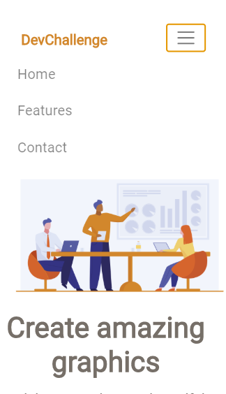

<h1 align="center">My AmazingGraph</h1>

 
<i>Status: Concluído</i>

## Descrição

 Site feito a partir do <a href="https://devchallenge.com.br/detail/5ec9a7fc10e94a38493d3910">DevChallennge,</a> feito para prática

## Features

[x] responsivo

### Tecnologias

- Html
- Bootstrap
- Css

### Link

https://thomaslincoln.github.io/My-AmazingGraph/

### Projeto

<table>
<tr>
<td></td> 
<td></td>
<td></td>
<tr>
</table>

### Contribuição 

- Thomas Lincoln V. da Silva